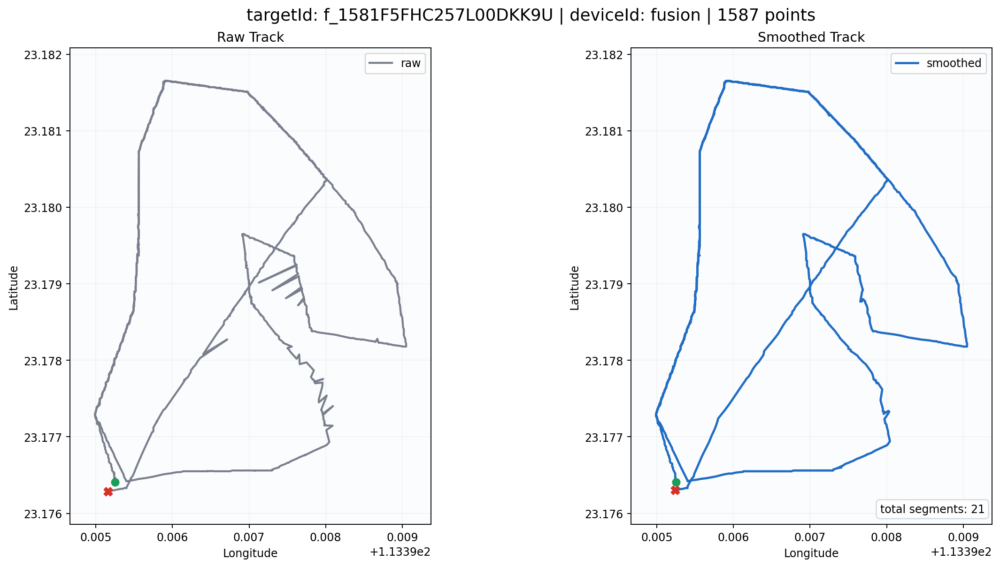
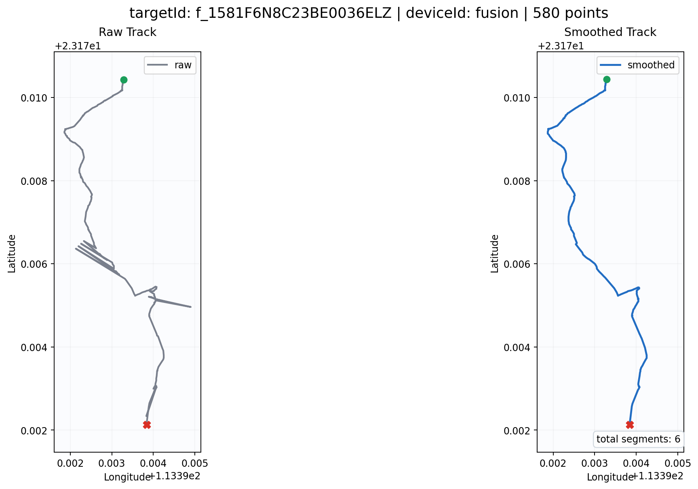
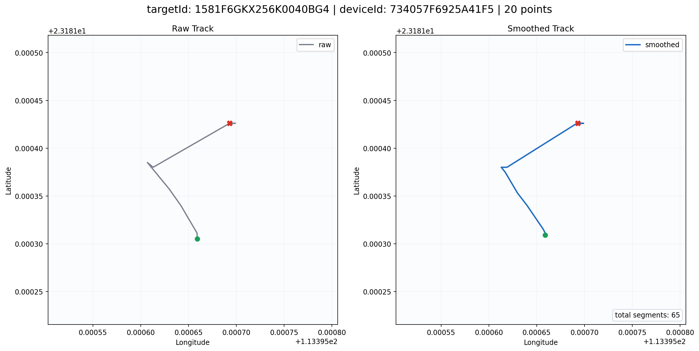
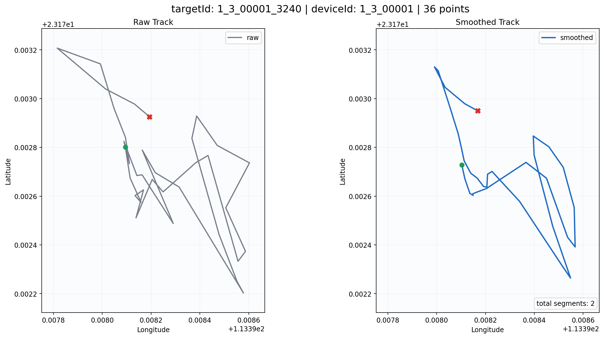

# Drone-Kalman-Filter

面向 `DetectionTarget` 消息流的无人机轨迹平滑项目。

项目目标很明确：
- 接收实时逐条输入的目标 JSON
- 输出同结构的平滑后 JSON
- 只修改 `spatial.position.latitude` 和
  `spatial.position.longitude`
- 其他字段全部透传

当前版本聚焦前端 2D 轨迹展示，不做跨 `deviceId` 的轨迹融合。

## 项目结构

- `src/drone_kalman_filter`
  - 实时平滑主链路
- `tooling/drone_kalman_validation`
  - 离线验收、诊断、预分析工具
- `tooling/drone_kalman_visualization`
  - 原始轨迹 / 平滑轨迹对比图
- `showcase/featured`
  - 精选结果图

## 安装

```bash
python -m pip install -e .
```

## 快速使用

### 实时逐条接入

```python
from drone_kalman_filter import DroneKalmanFilterPlugin, PluginConfig

plugin = DroneKalmanFilterPlugin(
    PluginConfig(smoother_mode="robust_prefilter_kalman")
)

outputs = plugin.process(message_dict)
for item in outputs:
    consume(item)

for item in plugin.flush():
    consume(item)
```

这套接口是流式的：
- `process(message)` 每次喂入 1 条消息
- 返回 `list`，因为固定滞后窗口不一定每输入 1 条就立即输出 1 条
- 流结束、切流或长时间空闲时调用 `flush()`

### 批量处理 JSONL

```bash
python -m drone_kalman_filter.cli smooth ^
  --smoother-mode robust_prefilter_kalman ^
  --input data\core-target-raw.jsonl ^
  --output out\core-target-smoothed-robust.jsonl
```

## 输入和输出

输入：
- 单条 `DetectionTarget` JSON
- 或一行一条 JSON 的 `JSONL` 文件

输出：
- 同结构 `DetectionTarget` JSON
- 只修改 `latitude / longitude`
- 其余字段透传

这也是当前集成时最重要的约束：**主链路不会改消息结构。**

更完整的接入细节见：
- [对接说明](对接说明.md)

## 当前算法

主链路提供两种模式：

- `kalman`
  - 固定滞后窗口的 Kalman / RTS 风格平滑
- `robust_prefilter_kalman`
  - 先做鲁棒预处理，再进入 Kalman 主链路
  - 当前更适合前端展示目标

当前实现只做 2D `lat/lon` 平滑，不处理 3D 高度。

更详细的技术设计见：
- [技术实现说明](技术实现说明.md)

## 结果示例

下面几张图都来自当前仓库里的真实回放结果。

### `fusion` 高频轨迹

原始轨迹存在明显高频折返和局部跳变，平滑后主形状更连续。



### `fusion` 高频抖动样本

这类样本更能暴露高频突跳，当前版本已经能明显压掉大部分叉形残留。



### 长 gap 碎片轨迹

这类样本主要用来看长时间断续上报时，算法会不会错误连线。



### 短命高杂波目标

这类目标最容易拉低整文件观感，也是当前鲁棒策略的重点观察对象。



## 验证与诊断

项目里保留了三类辅助工具：

- `drone_kalman_filter.cli acceptance`
  - 生成验收摘要
- `drone_kalman_validation`
  - 做 preflight、validate、diagnose、baseline
- `drone_kalman_visualization`
  - 生成最直观的轨迹对比图

这些工具的目标不同：
- 看接入：优先看《对接说明》
- 看实现：优先看《技术实现说明》
- 看效果：优先看 `showcase/featured`

## 测试

```bash
python -m pytest -q
```

当前测试覆盖：
- 实时主链路输入输出
- `kalman` 和 `robust_prefilter_kalman`
- synthetic 跳变回归
- 全量回放 golden 对比
- `raw2` 预分析与回放工具
